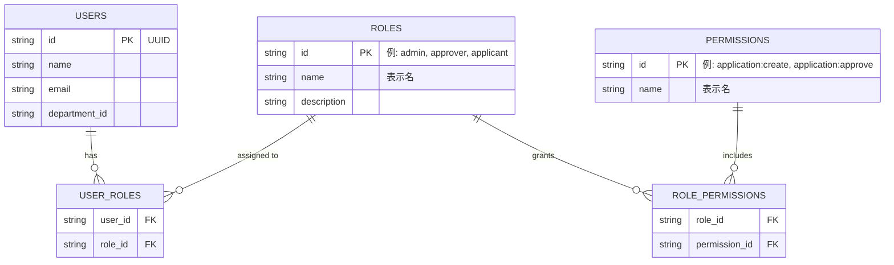

# RBAC (Role-Based Access Control) 設計と実装パターン

本ドキュメントでは、本申請・承認ワークフローWebアプリケーションにおいて推奨される **RBAC（ロールベースアクセス制御）** のアーキテクチャ設計および、`draft.txt` の技術スタック（Hono + Cloudflare D1 / オンプレ切り替え）に基づいた具体的な実装パターンを解説します。主に開発アーキテクトの方を対象としています。

---

## 1. RBACの基本概念とメリット

**RBAC (Role-Based Access Control)** とは、システムへのアクセス権限を「ユーザー」に直接付与するのではなく、「ロール（役割）」に付与し、ユーザーにそのロールを割り当てるアクセス制御モデルです。

### メリット
- **管理の容易性**: 組織変更や人事異動があった場合でも、ユーザーのロールを変更するだけで権限の再設定が完了します。
- **最小権限の原則の徹底**: 業務（ロール）に必要な権限のみを定義しやすくなります。
- **スケーラビリティ**: システムの機能が増えても、パーミッション（操作権限）を追加し、既存のロールに紐付けるだけで対応可能です。

### 他のアクセス制御モデルとの比較

| 方式 | 概要 | 特徴・適用シーン | 本アプリとの相性 |
| :--- | :--- | :--- | :--- |
| **ACL (Access Control List)** | リソースごとに「誰が何を行えるか」を直接リスト化する。 | 小規模なシステムや、ファイルシステム等のシンプルな権限管理に向く。ユーザー数が増えると管理が煩雑になる。 | △ ユーザーや承認パターンが可変であるため、管理コストが高い。 |
| **RBAC (Role-Based Access Control)** | ユーザーに「ロール」を付与し、ロールに「パーミッション」を紐付ける。 | 企業向けの業務システム（BtoB SaaSや社内システム）のデファクトスタンダード。組織の役職や職務とマッピングしやすい。 | ◎ 承認ワークフロー（申請者、承認者、管理者）の概念と非常にマッチする。 |
| **ABAC (Attribute-Based Access Control)** | ユーザー属性、環境（時間、IP等）、リソース属性などを組み合わせて動的に評価する。 | 非常に細粒度な制御が可能だが、設計と実装（評価エンジンの構築）の難易度が高い。 | △ 要件に対して過剰（オーバースペック）。ただし「特定部署のみ」等の簡単な属性評価はRBACと組み合わせることもある。 |

本アプリケーションにおいては、管理コストと柔軟性のバランスから **RBAC** が最適と判断します。

---

## 2. データベース設計（ER図）

RBACを実現するための基本的なテーブル構成です。D1（SQLite）およびオンプレDB（PostgreSQL/MySQL等）の両方で動作するよう、標準的なリレーショナルモデルを採用します。



### 主要テーブルの解説
*   `USERS`: ユーザー基本情報。
*   `ROLES`: ロール（役割）。例：`system_admin`（システム管理者）、`department_head`（部門長）、`general_employee`（一般社員）など。
*   `PERMISSIONS`: システム上の具体的な操作権限。リソースとアクションの組み合わせで定義すると管理しやすいです（例: `application:read`, `application:create`, `application:approve`, `master:manage`）。
*   `USER_ROLES` / `ROLE_PERMISSIONS`: 多対多の関係を表現する中間テーブル。

*※ よりシンプルな実装（ロールが固定でパーミッションを細かく制御しない場合）であれば、`USERS` テーブルに直接 `role` カラム（enum等）を持たせる「簡易RBAC」からスモールスタートすることも検討可能です。しかし、本要件は「承認パターン(複数)の管理機能」を包含するため、将来の拡張を見据え分離方式を推奨します。*

---

## 3. 実装パターン (Hono + JS/TS)

ここでは、Honoを用いたWeb APIサーバーにおいてRBACをどう実装するかのパターンを示します。

### 3.1. 権限チェックのミドルウェア

Honoの強力なミドルウェア機能を活用し、特定のエンドポイントに対するアクセス権を検証します。

```typescript
import { Context, Next } from 'hono'

// ユーザー情報が Context にセットされている前提（認証ミドルウェア通過後）
// c.get('user') = { id: '...', permissions: ['application:read', 'application:create'] }

export const requirePermission = (requiredPermission: string) => {
  return async (c: Context, next: Next) => {
    const user = c.get('user')

    if (!user || !user.permissions) {
      return c.json({ error: 'Unauthorized' }, 401)
    }

    if (!user.permissions.includes(requiredPermission)) {
      return c.json({ error: 'Forbidden: Insufficient permissions' }, 403)
    }

    await next()
  }
}
```

### 3.2. ルーティングでの適用

定義したミドルウェアを各ルートに適用します。これにより、ビジネスロジック（ハンドラ）内に権限チェックのコードが散在するのを防ぎます。

```typescript
import { Hono } from 'hono'
import { requirePermission } from './middleware/rbac'

const app = new Hono()

// 一般社員（申請者）向け
app.post('/api/applications',
  requirePermission('application:create'),
  async (c) => {
    // 申請作成ロジック
    return c.json({ message: 'Created' })
  }
)

// 承認者向け
app.post('/api/applications/:id/approve',
  requirePermission('application:approve'),
  async (c) => {
    // 承認ロジック
    return c.json({ message: 'Approved' })
  }
)

// システム管理者向け
app.post('/api/roles',
  requirePermission('master:manage'),
  async (c) => {
    // ロール管理ロジック
    return c.json({ message: 'Role created' })
  }
)

export default app
```

### 3.3. データアクセスの抽象化 (Repository Pattern)

`draft.txt` にある「オンプレ切り替え可能なラッパー」を実現するために、ユーザーの権限（パーミッション）を取得するロジックはRepositoryとして抽象化します。

```typescript
// /domain/repositories/UserRepository.ts
export interface UserRepository {
  // ユーザーIDから、そのユーザーが持つ全てのパーミッションIDの配列を取得する
  getUserPermissions(userId: string): Promise<string[]>
}
```

#### D1向けの実装例
```typescript
// /infrastructure/d1/D1UserRepository.ts
import { UserRepository } from '../../domain/repositories/UserRepository'

export class D1UserRepository implements UserRepository {
  constructor(private db: D1Database) {}

  async getUserPermissions(userId: string): Promise<string[]> {
    const query = `
      SELECT p.id
      FROM permissions p
      JOIN role_permissions rp ON p.id = rp.permission_id
      JOIN user_roles ur ON rp.role_id = ur.role_id
      WHERE ur.user_id = ?
    `
    const { results } = await this.db.prepare(query).bind(userId).all()
    return results.map(row => row.id as string)
  }
}
```

#### オンプレDB（例：PostgreSQL + Kysely）向けの実装例
```typescript
// /infrastructure/onprem/PgUserRepository.ts
import { UserRepository } from '../../domain/repositories/UserRepository'
import { Kysely } from 'kysely'
import { Database } from './types' // Kyselyのスキーマ定義

export class PgUserRepository implements UserRepository {
  constructor(private db: Kysely<Database>) {}

  async getUserPermissions(userId: string): Promise<string[]> {
    const results = await this.db.selectFrom('permissions as p')
      .innerJoin('role_permissions as rp', 'p.id', 'rp.permission_id')
      .innerJoin('user_roles as ur', 'rp.role_id', 'ur.role_id')
      .select('p.id')
      .where('ur.user_id', '=', userId)
      .execute()

    return results.map(row => row.id)
  }
}
```

認証通過後、セッションやJWTトークンを生成するタイミングで、上記のリポジトリを呼び出してユーザーの `permissions` を取得し、トークンに含める（または都度キャッシュから引く）ことで、Honoのミドルウェアで高速な権限チェックが可能になります。
